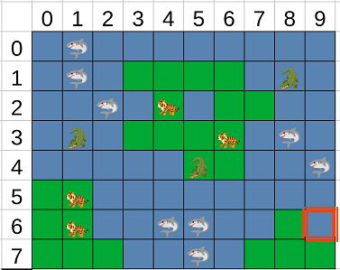

## The project 🚀
The  concept of the game is a variant of minesweeper. There are three types of mines which are animals : crocodiles, sharks and tigers. Those animals live on two different terrains : water and land. Sharks can only be in water and tigers on land while crocodiles can be on both terrains.

Knowing those rules and some data about the current grid (water and land numbers, animals count and grid dimensions), the objective of the project was to create a Python program that can resolve automatically every given map.

To do so we used a knowledge base composed of the translation of the rules applied for each case. As soon as we get a new certainty about the map, it is added to the knowledge base and the program loop again. To avoid infinite loops on a cell list where nothing can be deducted, we use random discovering to meet new cells if we are lucky.

## What I learned 🌟
- It reinforced my knowledge in Python
- A real application of basic AI and expert system theories

## Gallery 🖼️

||
:-------------------------:
|An example of a grid our player had to resolve|
